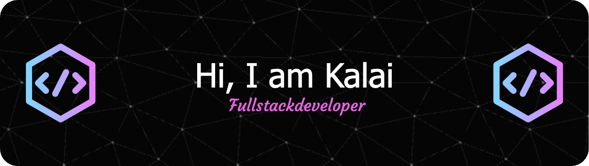

- 🔭 I’m currently working on Web development Projects.
- 🌱 I’m currently learning and doing Projects.
- 👯 I’m looking to collaborate on LinkedIn and GitHub.
- 💬 Ask me about Web Developement
- 📫 How to reach me: kalaiwebdev@gmail.com
<!--<h2> Kalaivani's GitHub Contribution</h2> 

 -->

<h3 align="left">Languages and Tools:</h3>  

                   

   

<!--

 

&nbsp;

  

  

  

### Blogs posts

<h3 align="left">Connect with me:</h3>

-->
